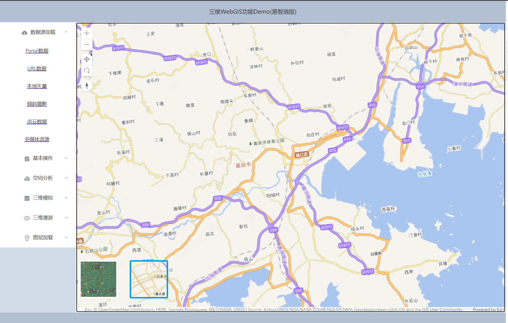
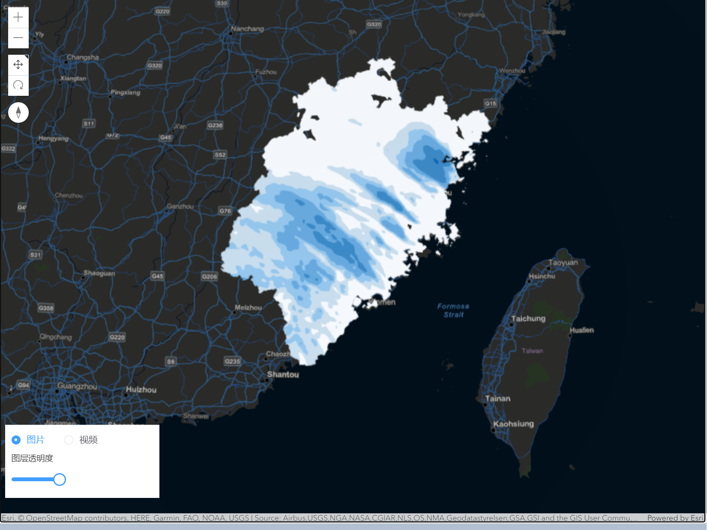

# 使用

## Project setup
```
npm install
```

### Compiles and hot-reloads for development
```
npm run serve
```

### Compiles and minifies for production
```
npm run build
```


# 内容介绍

## 说明
 
时光飞速，自从毕业我也好久没怎么用ArcGIS了，后台也确实有很多小伙伴在私信要源码，正好最近放假抽空整理一下，慢慢完善过程中，不定期更新，已完成的部分，我会补充放在md的下面，同时不断补充这份文档说明，每份案例因为个人的思考有限，没办法考虑的很全，所以欢迎小伙伴的补充或者欢迎私聊我重新添加新需求~~
距离我的毕设时间已经过了很久，以前发布的服务很多已经不能再用了，因为三维的服务需要托管到Portal，现在的我也已经失去了当年的学生免费权限，如果哪天再能有免费发布服务的机会，后续开个课都没有问题，现在的话你们有需要可以看我的demo和借鉴ArcGIS的官网，官网的教程已经很全面了，我的大多数也是来源于官网的启发。后续，我也会在官网的基础上对一部分内容进行整合，
本次demo如果没有对应的服务我会借鉴ArcGIS官网的服务。

官网API文档：https://developers.arcgis.com/javascript/latest/api-reference/

官网沙盒：https://developers.arcgis.com/javascript/latest/sample-code/


本demo暂不接入后台，流程很简单，能跑起来就能看到效果，采用Vue-cli2搭建，我的CSS学的不是很好，凑活着可以看效果，如果有美感比较看不下去的同学，可以顺道改改样式，本人也不介意。
希望在看的你有三剑客（html、css或javascript）的基础，最好能看懂Vue2的语法，推荐Vue的官网，不然的话可以去BiliBili刷刷视频，不要嫌我啰嗦，这是很多初学者经常在问的。

## 图层加载

图层是ArcGIS中的一个重要的组成概念。通常在 ArcGIS中加载图层时，可以按照以下步骤进行操作：

* 创建图层对象：根据您需要加载的图层类型，创建相应的图层对象。例如，如果要加载矢量图层，可以使用 esri/layers/FeatureLayer；如果要加载切片图层，可以使用 esri/layers/TileLayer；如果要加载动态图层，可以使用 esri/layers/MapImageLayer 等。

* 配置图层参数：根据您的需求，配置图层对象的属性和参数。这可能包括设置图层的 URL、样式、渲染方式、可见性等。

* 将图层添加到地图中：通过地图对象的 add() 方法将图层对象添加到地图中。这样，图层就会在地图上显示出来。

> WebTileLayer(加载天地图)

天地图是一种基于 Web 切片的地图服务。WebTileLayer 是专门用于加载 Web 切片地图服务的图层类。

天地图以切片（Tile）的形式提供地图数据，切片是将地图数据分割成小块的图像，可以根据当前地图范围和缩放级别请求相应的切片，从而实现快速加载和显示地图。

WebTileLayer 类提供了加载 Web 切片地图服务所需的功能和配置选项，包括指定地图服务的 URL、切片模板、切片大小、切片样式等。通过使用 WebTileLayer 类，可以直接加载天地图的切片数据，并将其作为图层添加到 ArcGIS 的地图中进行显示。

本示例中加载了影像和矢量的天地图底图，方便



## 数据源加载

> 加载OSGB倾斜摄影数据


> 加载点云数据


> MediaLayer 加载自定义坐标范围的多媒体资源


MediaLayer 是一种特殊的图层类型，用于显示多媒体资源，如静态图片、动态图片（GIF）、视频、音频、卫星图像、航拍照片、实地摄影和监控视频等。将多媒体元素与地理位置相关联，并在地图上进行显示，从而实现地理信息的可视化呈现。

以下是 MediaLayer 的一些主要作用和特点：

* 地理位置关联：MediaLayer 允许将多媒体元素与地理位置相关联。通过指定元素的地理参考（地理范围或坐标），可以在地图上准确地定位和显示多媒体内容。

* 多媒体内容展示：MediaLayer 可以显示各种类型的多媒体内容，包括图片、视频和音频。这使得可以在地图上以可视化的方式呈现多媒体信息，例如显示卫星图像、航拍照片、实地摄影、监控视频等。

* 图层叠加：MediaLayer 可以与其他图层进行叠加显示，使多媒体内容与其他地图要素（如矢量数据、栅格数据等）进行交互展示，从而提供更丰富的地图视觉效果和信息展示。

* 透明度控制：MediaLayer 具有透明度属性，可以通过调整透明度来控制多媒体内容的可见度，实现图层的混合和遮罩效果。

* 动态更新：MediaLayer 支持动态更新多媒体内容，可以根据需要实时加载或更换多媒体资源，从而实现实时展示和切换不同的多媒体内容。

* 交互式操作：MediaLayer 可以与其他地图操作和工具进行交互，例如缩放、平移、旋转等。这使得用户可以在地图上自由操作和浏览多媒体内容。




