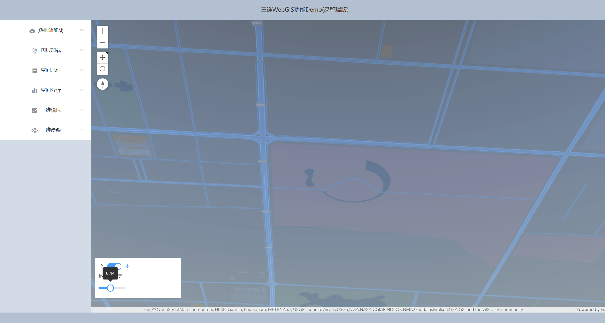
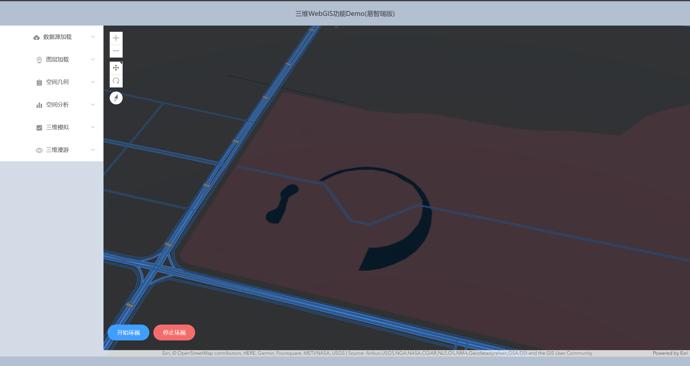
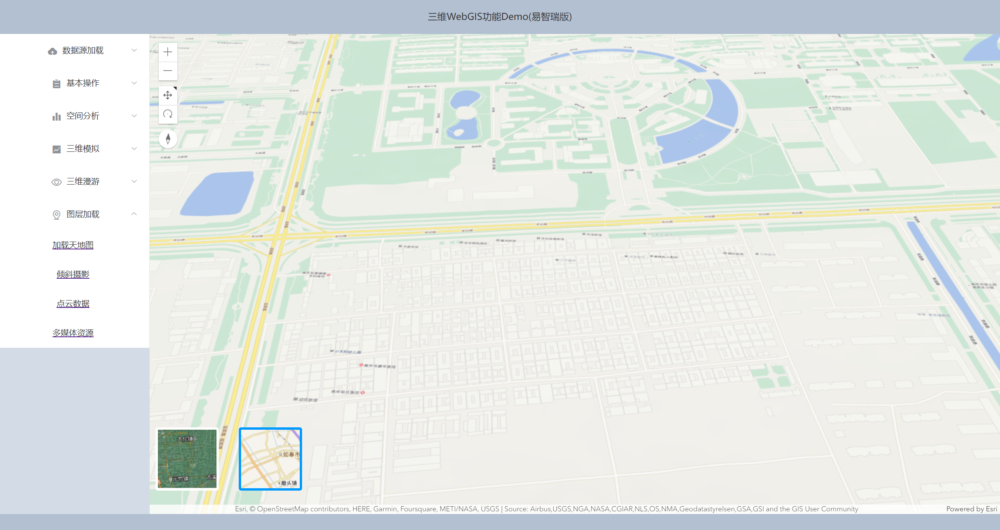
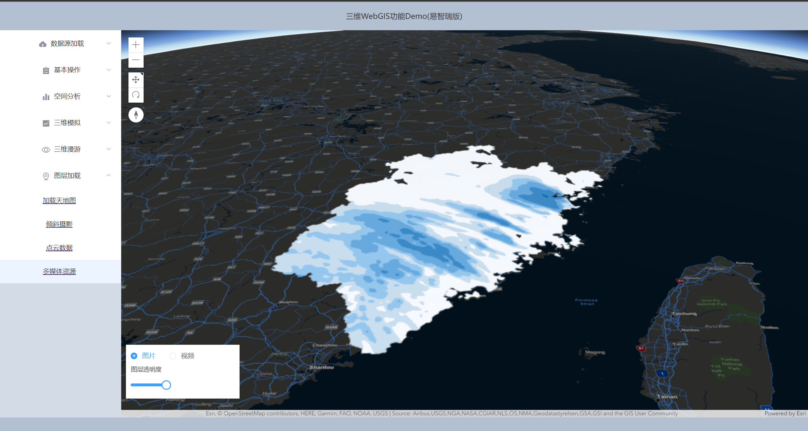
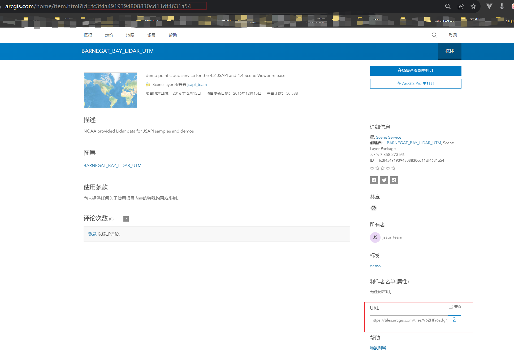
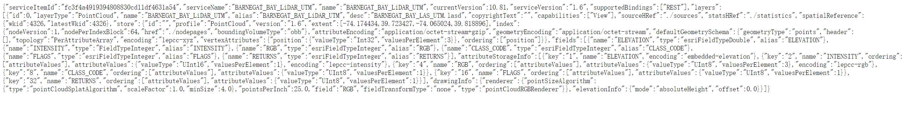
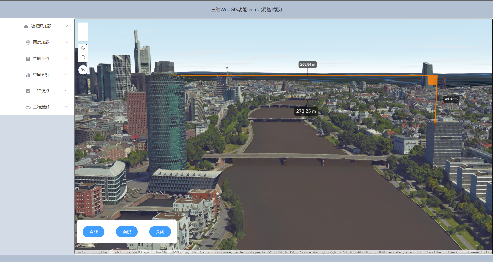
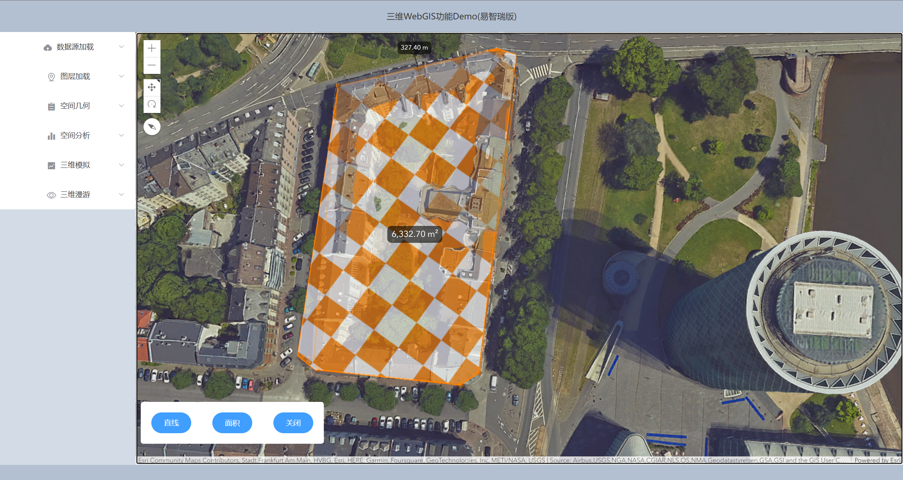

# 使用说明

## Project setup
```
npm install
```

### Compiles and hot-reloads for development
```
npm run serve
```

### Compiles and minifies for production
```
npm run build
```


# 内容介绍

## 简要说明
 
时光飞速，自从毕业我也好久没怎么用ArcGIS了，后台也确实有很多小伙伴在私信要源码，正好最近放假抽空整理一下，慢慢完善过程中，不定期更新，已完成的部分，我会补充放在md的下面，同时不断补充这份文档说明，每份案例因为个人的思考有限，没办法考虑的很全，所以欢迎小伙伴的补充或者欢迎私聊我重新添加新需求~~

距离我的毕设时间已经过了很久，以前发布的服务很多已经不能再用了，因为三维的服务需要托管到Portal，现在的我也已经失去了当年的学生免费权限，如果哪天再能有免费发布服务的机会，后续开个课都没有问题，现在的话有需要可以看我的demo和借鉴ArcGIS的官网，官网的教程已经很全面了，我的demo大多数也来源于官网的启发。后续我也会在官网的基础上对一部分内容进行整合，本次demo如果没有对应的服务我会借鉴ArcGIS官网的服务。

[API文档](https://developers.arcgis.com/javascript/latest/api-reference/) [沙盒](https://developers.arcgis.com/javascript/latest/sample-code/)


本demo暂不接入后台，流程很简单，能跑起来就能看到效果，采用Vue-cli2搭建， ArcGIS API for JavaScript的一些常用的demo，提供业务常用的gis功能。希望在看的你有三剑客（html、css或javascript）的基础，最好能懂Vue2的语法，推荐Vue的官网，不然的话可以去网站刷刷视频，不要嫌我啰嗦，这是很多初学者经常问的。不想跑项目的话，你就将就看看说明文档的截图，有个大致印象。

## 数据源加载


## 三维漫游

> 相机参数


> 地上地下

受官网的这个[demo](https://developers.arcgis.com/javascript/latest/sample-code/sandbox/?sample=sceneview-underground)的启发，创建了一个类似地下管廊的场景视图，并允许用户在地下环境中进行导航和探索。通常情况下，全球模式默认只显示地表数据，但通过开启地下模式，用户可以沉浸在地下的世界中，发现地下管道和设施。你可以使用用户界面上的控件来调整图层的透明度，以展示地下管廊的结构和布局。这样，你可以更清晰地了解地下管道的走向、连接和布置方式。

这个功能对于地下管廊的规划、维护和紧急情况响应非常有用。它提供了一种直观的方式，让用户在虚拟环境中自由浏览地下结构，观察管道的状态、检查设备和进行必要的操作。

这个功能使得地下管廊的工作人员可以更好地理解和管理地下基础设施，提高工作效率、降低风险，并更好地应对各种挑战和紧急情况。为地下管廊的可视化和管理提供了一种创新的解决方案。无论是规划新的管道项目还是维护现有的基础设施，这个功能都能帮助用户更好地理解和操作地下空间。



> 360环视

* 功能介绍
  
通过设置一个旋转半径和起始点的经纬度坐标，可以自动旋转视角围绕起始点进行环视操作。提供用户一种沉浸式的体验，使其能够360度全方位地查看指定地点的环境。它可以用于旅游网站、地理信息展示应用等场景，让用户更好地了解和观察不同地点的景观。

环视的核心方法 (rotateView)：

```
通过调用 startView() 和 stopView() 方法来控制环视的开始和停止。
环视开始时使用定时器 setInterval 执行以下操作：
每次循环，角度变量 i 增加 1。
如果角度变量 i 大于等于 360，停止环视操作并返回。
根据当前角度计算新的经纬度坐标 X1 和 Y1。
使用 view.goTo() 方法将地图视图移动到计算得到的新位置。设置参数包括方向角、经度、纬度和高程。
上述算法使用了三角函数来计算新的经纬度坐标，并通过 view.goTo() 方法实现地图视图的平滑过渡。定时器每隔 100 毫秒执行一次循环，控制环视速度。

```


## 图层加载

图层是ArcGIS中的一个重要的组成概念。通常在 ArcGIS中加载图层时，可以按照以下步骤进行操作：


1、创建图层对象：
根据您需要加载的图层类型，创建相应的图层对象。例如，如果要加载矢量图层，可以使用 `esri/layers/FeatureLayer`；如果要加载切片图层，可以使用 `esri/layers/TileLayer`；如果要加载动态图层，可以使用` esri/layers/MapImageLayer` 等。

2、配置图层参数：
根据需求，配置图层对象的属性和参数。这可能包括设置图层的 URL、样式、渲染方式、可见性等。

3、将图层添加到地图中：
通过地图对象的 add() 方法将图层对象添加到地图中。这样图层就会在地图上显示出来。


> WebTileLayer(加载天地图)

天地图是一种基于 Web 切片的地图服务。`esri/layers/WebTileLayer`是专门用于加载 Web 切片地图服务的图层类。

天地图以切片（Tile）的形式提供地图数据，切片是将地图数据分割成小块的图像，可以根据当前地图范围和缩放级别请求相应的切片，从而实现快速加载和显示地图。

`WebTileLayer` 类提供了加载 Web 切片地图服务所需的功能和配置选项，包括指定地图服务的 URL、切片模板、切片大小、切片样式等。通过使用 `WebTileLayer` 类，可以直接加载天地图的切片数据，并将其作为图层添加到 ArcGIS 的地图中进行显示。

本示例中加载了影像和矢量的天地图底图，方便读者更直观的查看。



> MediaLayer 加载自定义坐标范围的多媒体资源

`esri/layers/MediaLayer` 是一种特殊的图层类型，用于显示多媒体资源，如静态图片、动态图片（GIF）、视频、音频、卫星图像、航拍照片、实地摄影和监控视频等。将多媒体元素与地理位置相关联，并在地图上进行显示，从而实现地理信息的可视化呈现。

以下是 `MediaLayer`类 的一些主要作用和特点：

* 地理位置关联：MediaLayer 允许将多媒体元素与地理位置相关联。通过指定元素的地理参考（地理范围或坐标），可以在地图上准确地定位和显示多媒体内容。

* 多媒体内容展示：MediaLayer 可以显示各种类型的多媒体内容，包括图片、视频和音频。这使得可以在地图上以可视化的方式呈现多媒体信息，例如显示卫星图像、航拍照片、实地摄影、监控视频等。

* 图层叠加：MediaLayer 可以与其他图层进行叠加显示，使多媒体内容与其他地图要素（如矢量数据、栅格数据等）进行交互展示，从而提供更丰富的地图视觉效果和信息展示。

* 透明度控制：MediaLayer 具有透明度属性，可以通过调整透明度来控制多媒体内容的可见度，实现图层的混合和遮罩效果。

* 动态更新：MediaLayer 支持动态更新多媒体内容，可以根据需要实时加载或更换多媒体资源，从而实现实时展示和切换不同的多媒体内容。

* 交互式操作：MediaLayer 可以与其他地图操作和工具进行交互，例如缩放、平移、旋转等。这使得用户可以在地图上自由操作和浏览多媒体内容。



> IntegratedMeshLayer 加载OSGB倾斜摄影数据

倾斜摄影数据是一种用于创建高分辨率三维模型的图像数据集合。它通常由飞行器（如飞机、无人机或直升机）在不同角度和方向上捕获的斜向图像组成。这些图像提供了地面或建筑物的多个视角，从而可以生成高精度的三维模型和倾斜摄影图。

* arcgis中如何处理OSGB倾斜摄影数据及如何发布服务


使用易智瑞（pro）提供的工具箱将osgb转为slpk(osgb转slpk);输入你的倾斜摄影的文件夹，

slpk数据在arcgis Pro中可以正常预览

发布成服务

* 前端图层加载


对倾斜摄影数据的处理：裁剪、掩膜、压平


> PointCloudLayer 加载点云数据

* arcgis中如何处理点云数据及如何发布服务

* 前端图层加载点云图层

加载点云数据有两种方式，一种用url的方式，见另一种用portalItem id的方式，见

* 点云图层的渲染(分类型)

* PointCloudRGBRenderer
* PointCloudUniqueValueRenderer
* PointCloudStretchRenderer
* PointCloudClassBreaksRenderer


> 加载BIM模型

* arcgis Pro中如何处理BIM模型并发布服务


* 前端图层加载BIM图层
  
1、创建 BIM 图层：

使用 ArcGIS API for JavaScript 的图层类（例如 SceneLayer）创建一个 BIM 图层。
设置图层的 URL 属性为包含 BIM 模型数据的服务 URL。

2、添加 BIM 图层到地图：

将创建的 BIM 图层对象添加到地图的图层集合中，以便在地图上进行显示和交互。
使用地图对象的 add() 方法将 BIM 图层添加到地图中。

3、配置 BIM 图层的属性和显示效果：

根据需要，可以设置 BIM 图层的属性和显示效果。
例如，可以设置图层的可见性、渲染方式（如颜色、透明度）、查询功能等。


## 空间几何

> 3D量测

测量工具是一个现成的微件类，api在 `esri/widgets/` 下，可以根据需要进行配置和自定义。
包含：`AreaMeasurement2D、AreaMeasurement3D、DirectLineMeasurement2D、DirectLineMeasurement3D`等；
`AreaMeasurement2D、AreaMeasurement3D` 主要测量面积和周长，`DirectLineMeasurement2D`主要测量直线距离，`DirectLineMeasurement3D`主要测量直线、水平、垂直距离。

目前在三维视图下选取 `AreaMeasurement3D、DirectLineMeasurement3D` ，二维可以选取  `AreaMeasurement2D、DirectLineMeasurement2D`；也可以直接选择 `Measurement` 这个微件，其中包含了面积和距离测量。view.ui.add() 方法将测量工具添加到地图视图的指定位置。

编写代码时，建议参考官方文档和示例代码，以获取准确的 API 用法和配置信息。

```javascript
    let activeWidget;
    if(type === 'distance'){
        activeWidget = new DirectLineMeasurement3D({
            view: view,
        });
        activeWidget.viewModel.start();
    } else if(type === 'area'){
        activeWidget = new AreaMeasurement3D({
            view: view,
        });
        activeWidget.viewModel.start();
    } else {
        this.removeMeasure();
    }
```

```javascript
const measurement = new Measurement({
  view: view
});
// 2D
// measurement.activeTool = "distance"||'area';
// 3D
measurement.activeTool = 'direct-line'||'area';
view.ui.add(measurement, "bottom-right");

```
效果如下：







